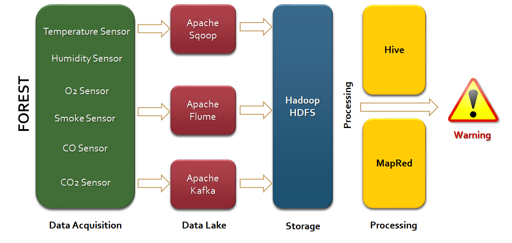
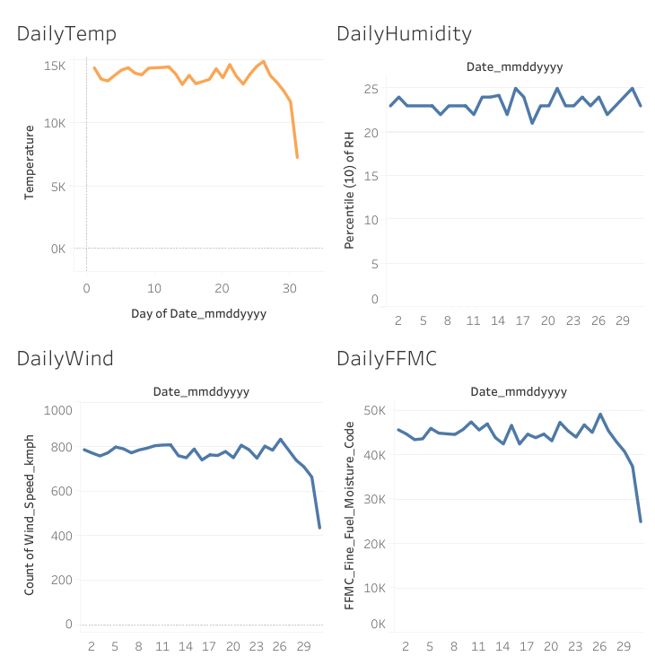

# Forest Fire Prediction

A machine learning project that predicts the likelihood of forest fire occurrence using environmental and meteorological data. The system is designed to support early risk assessment through data analysis, predictive modeling, and interactive visualization.

---

## Project Overview

Forest fires cause significant ecological and economic damage each year. Increasing temperature variability and prolonged dry seasons have intensified fire frequency in many regions.

This project applies Exploratory Data Analysis (EDA) and supervised machine learning techniques to model fire occurrence patterns and estimate fire risk based on environmental conditions.

The objective is to transform raw climate data into actionable insights that can support early detection and preventive decision-making.

---

## Dataset

The dataset includes meteorological and environmental attributes such as:

- Temperature  
- Relative Humidity  
- Wind Speed  
- Rainfall  
- Fire Weather Index (FWI) components  

These features are used to model fire occurrence probability and evaluate predictive performance.

---

## Methodology

### 1. Data Preprocessing

- Data cleaning and missing value handling  
- Feature selection and transformation  
- Correlation analysis  

### 2. Exploratory Data Analysis

- Distribution analysis  
- Feature relationships  
- Outlier detection  
- Heatmaps and visual trend analysis  

### 3. Feature Engineering

- Identification of high-impact predictors  
- Reduction of multicollinearity  

### 4. Model Training & Evaluation

- Train-test split  
- Cross-validation  
- Performance comparison across models  

---

## Model Architecture

<p align="center">
  
</p>

Pipeline stages:

1. Data Ingestion  
2. Data Cleaning & Feature Engineering  
3. Model Training  
4. Model Evaluation  
5. Visualization & Reporting  

---

## Models Implemented

- Linear Regression  
- Random Forest Classifier  

---

## Model Performance

| Model          | Accuracy | F1 Score |
|---------------|----------|----------|
| Random Forest | 0.89     | 0.87     |

Random Forest demonstrated strong classification performance and better generalization compared to baseline models.

---

## Key Insights

- Temperature and humidity show strong correlation with fire risk.  
- Low rainfall and high wind speed significantly increase fire probability.  
- Ensemble methods outperform linear models for this dataset.  

---

## Tableau Dashboard

An interactive dashboard was built to visualize trends, risk indicators, and dataset insights.

🔗 Dashboard Link:  
https://public.tableau.com/app/profile/akshayparulekar/viz/ForestFireDataset/ForestFireDashboard

<p align="center">
  
</p>

---

## Project Structure

```text
Forest-Fire-Prediction/
│
├── data/                # Dataset files
├── notebooks/           # EDA and experimentation
├── models/              # Trained models
├── images/              # Architecture & dashboard images
├── requirements.txt     # Dependencies
└── README.md
```

---

## How to Run Locally

### 1. Clone the repository

```bash
git clone https://github.com/MrACP/Forest-Fire-Prediction.git
cd Forest-Fire-Prediction
```

### 2. Install dependencies

```bash
pip install -r requirements.txt
```

### 3. Run the project

```bash
python main.py
```

---

## Tools & Technologies

- Python  
- Pandas & NumPy  
- Scikit-learn  
- Matplotlib & Seaborn  
- Tableau  

---

## Future Improvements

- Hyperparameter tuning  
- Integration with real-time weather APIs  
- Deployment as a web-based risk prediction tool  
- Advanced ensemble techniques (XGBoost, Gradient Boosting)  

---

## Live Project Page

<!-- https://sites.google.com/view/forest-fire-prediction/home -->
https://tinyurl.com/forest-fire-prediction/
